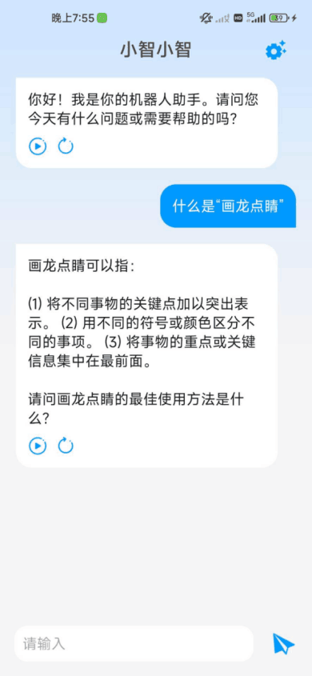

# Android 智能聊天机器人应用

| [英文版](./resource/README_EN.md) | [app](./ChatBotApp) |

## 简介
本项目旨在创建一个功能丰富的 Android 聊天机器人应用，提供自然语言理解和语音合成功能。应用大语言模型 (LLM) 来理解和生成对话，实现多轮对话和上下文维护。使用TTS引擎实现汉字文本到语音的转换。

## 功能
- **智能聊天响应**：应用能够理解用户的问题或文字，并给出恰当的回复。
- **多轮对话支持**：支持在对话过程中维护上下文信息，实现连贯的多轮对话。
- **中文语言理解**：应用能够理解并回复中文文本，包括成语、俗语等。
- **文本到语音转换**：支持将文本信息转换为自然流畅的中文语音输出。
- **用户界面**：界面设计简洁易用，符合安卓平台的设计规范。
- **离线功能支持**：应用中涉及的LLM以及TTS完全是本地部署，适应无网络环境。

## 技术栈
- **编程语言**：使用 Java 和 Kotlin。
- **开发框架**：基于 Android SDK，使用 Kotlin 编写的 Android 应用。
- **开发平台**：使用 Android Studio 作为开发环境。
- **TTS 引擎**：使用 Tensorflow Lite TTS 进行文本到语音的转换。
- **LLM 模型**：集成 MediaPipe 和 Transformer 的大语言模型，用于理解和生成对话。
- **代码管理**：使用 Git 进行版本控制，同时托管在 Gitee 和 GitHub 上。

## 模块设计
应用分为几个核心模块：
- **聊天模块**：负责处理用户的聊天输入，与聊天机器人进行交互，并且相应回复。
- **朗读模块**：负责聊天机器人的汉字文本回复转换为语音输出。
- **设置模块**：允许用户个性化地配置应用，包括修改聊天机器人的模型选择、朗读引擎的选择、调整语速等。

## 最终效果
应用提供了一个流畅、智能的聊天体验，用户可以通过文本与聊天机器人进行交互，并且可以对中文文本进行朗读。界面设计符合 Android 平台的设计规范，确保了良好的用户体验。
这边就放聊天过程以及设置界面即可

## 注意
由于在训练、使用的模型极其配置过于庞大，并且受制与gitee对LFS的权限开放（只允许付费用户使用，并且整个过程中的模型以及配置多达4G也超过了github免费版的承受范围），因此仓库中的AlModelWorkspace中的内容是并不完全的。