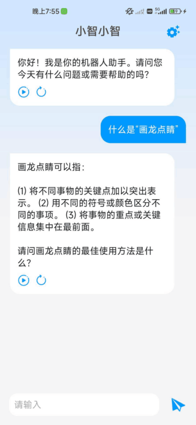
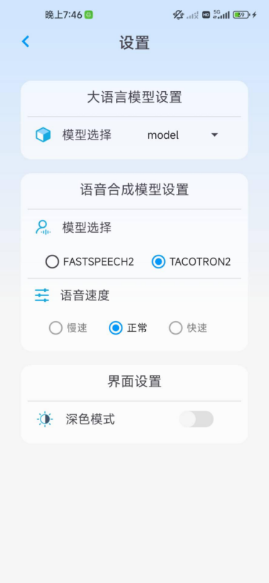

# Android Smart Chatbot Application

| [Chinese Version](../README.md) | [app](../ChatBotApp) |

## Introduction
This project aims to create a feature-rich Android chatbot application that offers natural language understanding and speech synthesis capabilities. The application utilizes large language models (LLMs) to comprehend and generate dialogue, achieving multi-turn conversations and context maintenance. It employs a TTS engine for the conversion of Chinese text to voice.

## Features
- **Intelligent Chat Response**: The application can understand user questions or text and provide appropriate responses.
- **Multi-turn Dialogue Support**: Maintains context information throughout the conversation, enabling coherent multi-turn dialogue.
- **Chinese Language Understanding**: The application can comprehend and respond to Chinese text, including idioms and proverbs.
- **Text-to-Speech Conversion**: Supports the transformation of text messages into natural and fluent Chinese voice outputs.
- **User Interface**: The interface is designed to be simple and user-friendly, aligning with Android platform design specifications.
- **Offline Functionality Support**: The LLM and TTS involved in the application are entirely locally deployed, adapting to environments without internet access.

## Technology Stack
- **Programming Languages**: Java and Kotlin are used.
- **Development Framework**: Based on the Android SDK, the application is written in Kotlin for Android.
- **Development Platform**: Android Studio serves as the development environment.
- **TTS Engine**: Tensorflow Lite TTS is used for text-to-speech conversion.
- **LLM Model**: Integrates a large language model combining MediaPipe and Transformer for understanding and generating dialogue.
- **Code Management**: Git is used for version control, and the code is hosted on both Gitee and GitHub.

## Module Design
The application is divided into several core modules:
- **Chat Module**: Manages user chat input, interacts with the chatbot, and provides responsive replies.
- **Speech Module**: Converts the chatbot's Chinese text responses into voice outputs.
- **Settings Module**: Allows users to personalize application settings, including modifying the chatbot model selection, choosing the speech engine, and adjusting speech speed.

## Final Outcome
The application delivers a smooth and intelligent chatting experience where users can interact with the chatbot via text and have Chinese text read aloud. The interface design adheres to Android platform design standards, ensuring an excellent user experience.

## Note
Due to the substantial size of the models and configurations used and trained in this project, and constraints imposed by Gitee's LFS permissions (which are limited to paying users and the entire set of models and configurations exceed the capacity of GitHub's free version at 4GB), the contents of the AlModelWorkspace in the repository are not complete.
